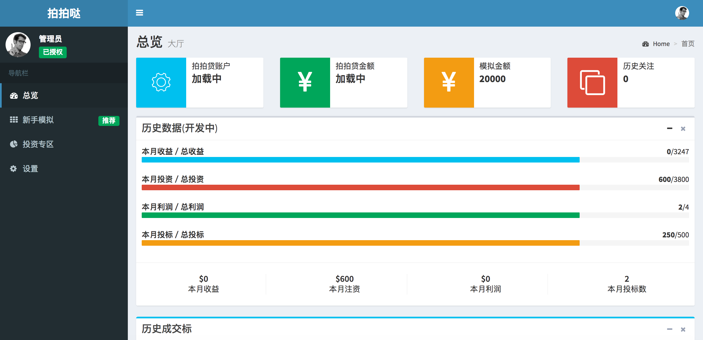
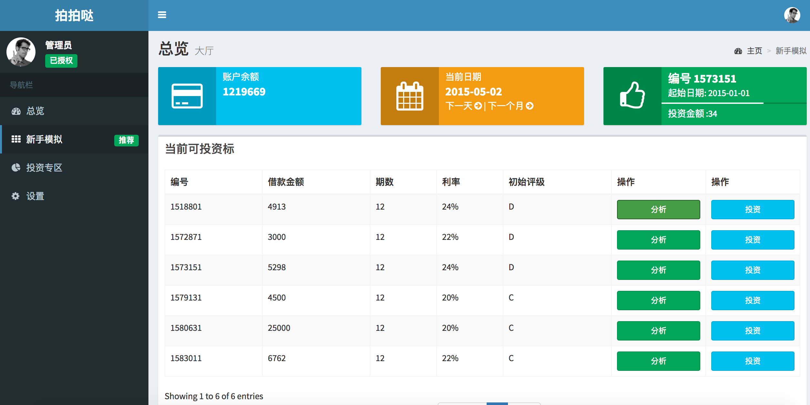
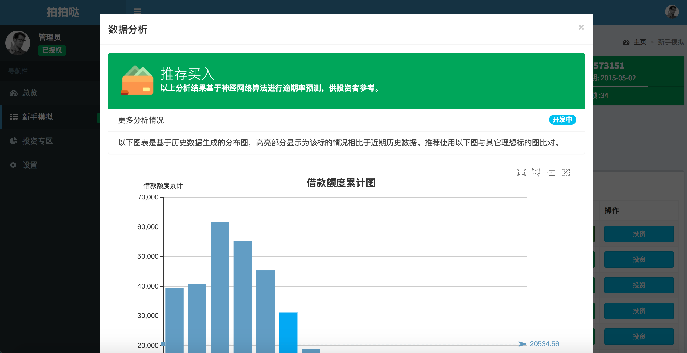
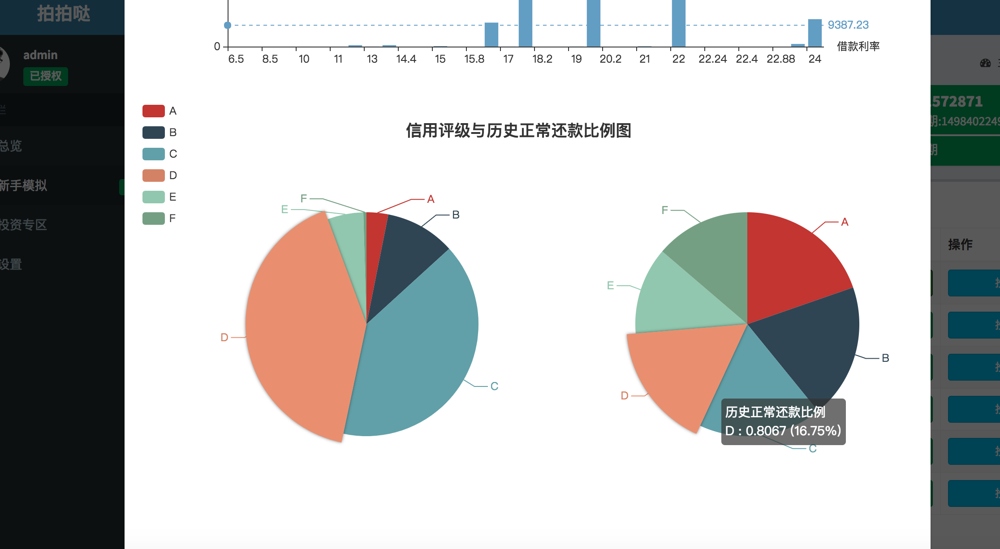
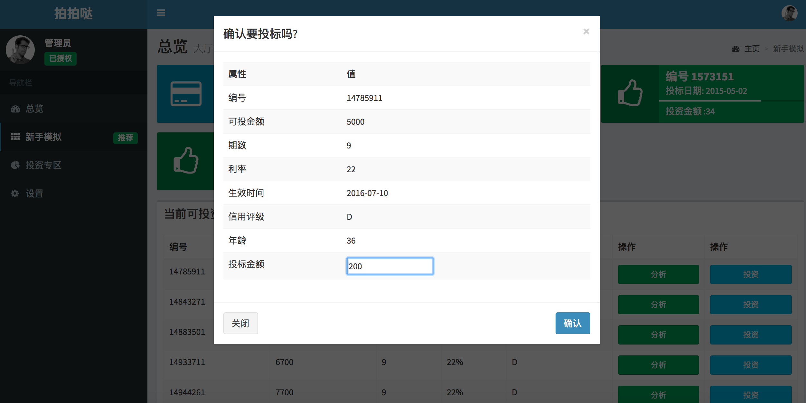
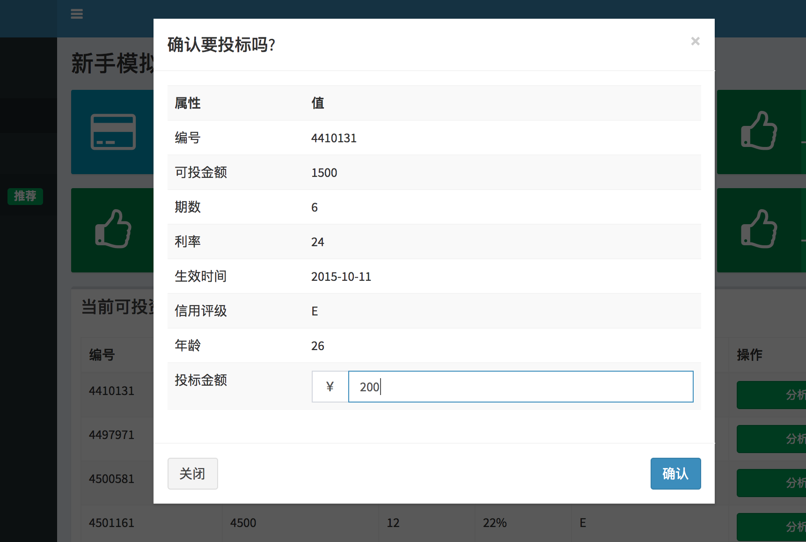
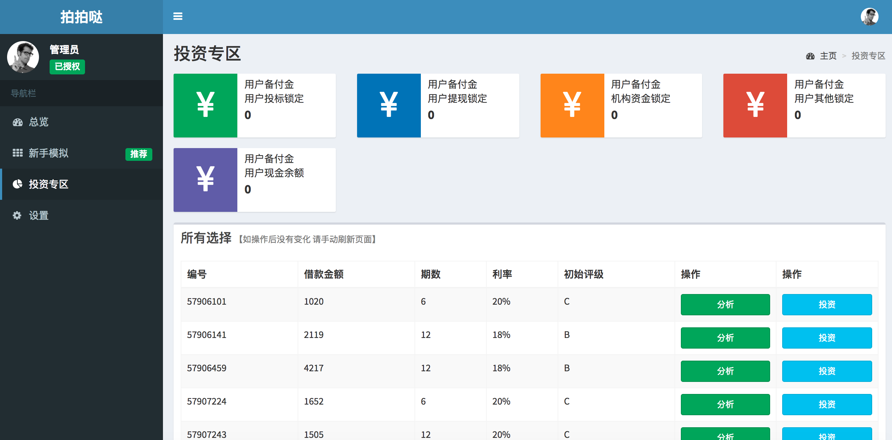
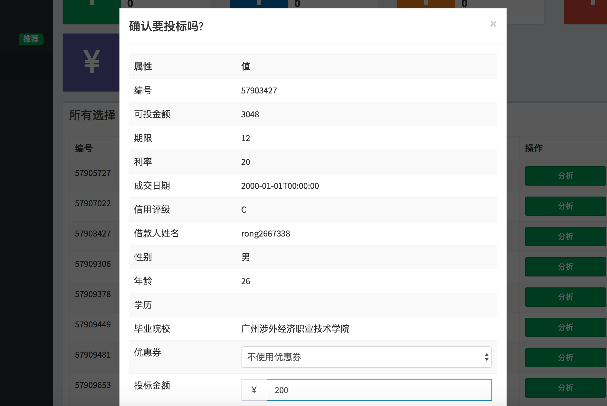

# 拍拍哒

🏄一个欢乐的投资分析平台，基于Thinkphp，总工划分为：

模拟平台——从已有的数据库读取数据，供用户学习

投资平台——获取真实数据，实时分析，真实交易

## 所用技术

**数据分析**

* Java
* Python

**Web前端**

* Bootstrap
* jQuery
* DataTables
* Echarts

**Web后端**

* Thinkphp 3.2
* MySQL

## 特性

- [x] 完整的用户登录、注册逻辑
- [x] 集成拍拍贷SDK到框架里，依赖RSA算法
- [x] 可以通过拍拍贷的OAuth授权到用户上
- [x] 不同用户可以储存不同的token信息
- [x] 构建了一个API用于读取特定的信息，可以批量读取投资信息
- [x] 构建了一个API用于读取单个的信息
- [x] 真实的模拟投资系统，根据日期的变化，改变可选投资项
- [x] 真实的投资功能
- [x] 数据可视化
- [x] 用缓存机制存储分析数据，高效快速
- [x] 基于神经网络算法进行逾期率预测


# 项目部署

1. 克隆本项目 git clone https://github.com/yfgeek/ppd

2. 在本项目的 [database 分支](https://github.com/yfgeek/ppd/tree/database)下 下载`sql`文件导入到数据库

3. 如果您使用的是Nginx，**不要忘记开启 path_info 或者添加 重写**，[详见](http://www.thinkphp.cn/topic/3138.html)

4. 确认 在目录`Application\Admin\Conf`与`Application\Common\Conf`下分别有config.sample.php

5. 分别执行y以下命令，并根据config.php中的注释修改相应的私密内容

   ```bash
   cp config.sample.php config.php
   vim config.php
   ```


## 截图

















## 

## 逻辑

**新手模拟**

设定，current_date默认值为2015年01月01日

当用户点击下一个月/下一日时，需要进行以下判断：

- 判断当前产品的可见性，如果可见性为0(false)，则不予以显示，也不参与计算，否则：
- 对用户当前投资的产品的 起始日期 与 生效日期 进行判断，如果 起始日期已经大于该产品的生效日期，则可以开始下一步计算
- 如果 用户的 当前日期 减去(-) 生效日期 > 期数 ，说明该产品的价值已经完毕，应该执行以下操作：
  * 将利率和本金加回用户余额
  * 将当前可见性标记为0
- 对current_date 直接进行操作

当用户点击投资的时候：

* 是否需要对当前日期和生效日期进行检查？不需要
* 系统自动将用户的数据库里的 当前日期转录到 bid表中的 biddate，并记录为购买日期，但要记住，并非是生效日期，为了方便数据操作，最好先将生效日期转录到数据库里
* 当用户已经有一个投资的商品的时候，点击了下一个月，此时当前日期是下一个月的日期


# 假如...

再有一次机会的话，我绝对不会选择ThinkPHP作为开发框架…不要问我为什么